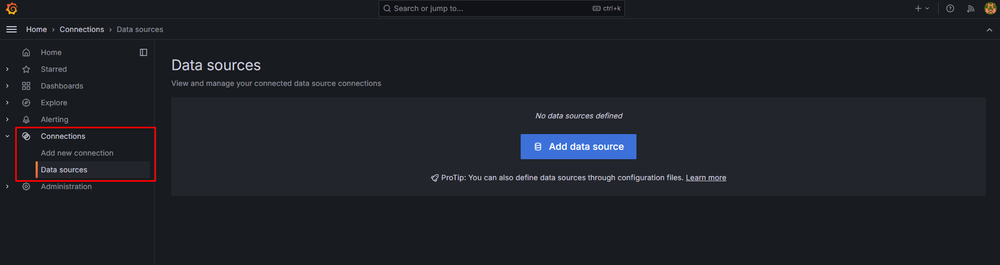

<h1>Passo a passo para rodar o projeto:</h1>

    <h2>Passo 1: Configurando o ambiente</h2>
    <ol>
        <li>
Certifique-se de ter o Docker instalado em sua máquina.
</li>
        <li>
            
Verifique se as portas necessárias para o projeto estão disponíveis. Se necessário, modifique-as.

            
As portas utilizadas são:

            <ul>
                <li>9104 : mysql-exporter</li>
                <li>6379 : redis</li>
                <li>8080 : wordpress</li>
                <li>9090 : prometheus</li>
                <li>3000 : grafana</li>
                <li>8081 : cadivisor</li>
            </ul>
        </li>
    </ol>

    <h2>Passo 2: Clonar e acessar repositório do projeto</h2>
    <ol>
        <li>
            
Escolha uma pasta no seu computador que não contenha caracteres especiais.

            
Abra o Git Bash e execute o comando a seguir:

            <pre><code>git clone https://github.com/mafebordignon/ProjetoDocker.git</code></pre>
        </li>
        <li>
            
Acesse a pasta do projeto:

            <pre><code>cd ProjetoDocker</code></pre>
        </li>
    </ol>

    <h2>Passo 3: Executar o projeto</h2>
    <ol>
        <li>
            
Inicie o Docker Swarm para rodar o projeto:

            <pre><code>docker swarm init</code></pre>
        </li>
        <li>
            
Execute o seguinte comando:

            <pre><code>docker stack deploy -c docker-compose.yml "nome_stack"</code></pre>
            
Isso iniciará os serviços definidos no arquivo <code>.yml</code>, que são:

            <ul>
                <li>mysql - banco de dados</li>
                <li>mysql-exporter - exporta dados do MySQL para o Prometheus</li>
                <li>redis - usado para armazenar em cache as consultas do WordPress</li>
                <li>wordpress - nosso site</li>
                <li>prometheus - ferramenta de monitoramento</li>
                <li>grafana - visualiza os dados do Prometheus em dashboards</li>
                <li>cadvisor - monitora o Docker e seus containers</li>
            </ul>
        </li>
    </ol>

    <h2>Passo 4: Configurar o WordPress</h2>
    <ol>
        <li>Acesse o link: <code>http://localhost:8080</code> no seu navegador.</li>
        <li>
            
Siga as instruções para configurar o WordPress. Não se preocupe com os dados inseridos, são apenas para teste.

        </li>
        <li>
            
Após a configuração, você será redirecionado para a página de administração:

                              
        </li>
        <li>
            
Acesse a seção de plugins, onde estão os plugins instalados:

            
        </li>
        <li>
            
Clique em "Adicionar plugin" para ir à página de adição de plugins:

            
        </li>
        <li>
            
Pesquise pelo plugin <code>Redis Object Cache</code>:

            
            
Instale e ative o plugin. Você verá a seguinte mensagem de erro de conexão:

            
        </li>
    </ol>

    <h2>Corrigir erro de conexão entre o Redis e o Docker</h2>
    <ol>
        <li>
            
Digite <code>sudo su</code> no terminal para se tornar o usuário root. Faça login com sua senha de root e execute:

            <pre><code>docker ps</code></pre>
            
Encontre o container do WordPress e copie seu <code>CONTAINER ID</code>.

        </li>
        <li>
            
Acesse o container com:

            <pre><code>docker exec -it "ID DO SEU CONTAINER" bash</code></pre>
        </li>
        <li>
            
Execute os comandos:

            <pre><code>apt update</code></pre>
            <pre><code>apt install nano</code></pre>
            
Isso atualizará o apt e instalará o editor nano para editar o arquivo <code>wp-config.php</code>.

        </li>
        <li>
            
Edite o arquivo <code>wp-config.php</code> com:

            <pre><code>nano wp-config.php</code></pre>
        </li>
        <li>
            
Adicione as seguintes linhas antes de <code>/* That's all, stop editing! Happy publishing. */</code>:

            <pre><code>define('WP_CACHE', true); define('WP_REDIS_HOST', 'redis'); define('WP_REDIS_PORT', 6379);</code></pre>
        </li>
        <li>
            
Salve o arquivo com <code>CTRL+O</code> e saia com <code>CTRL+X</code>.

        </li>
        <li>
            
Atualize a página de plugins do WordPress e veja se o Redis aparece como acessível:

            
            
Ative o cache de objeto e o Redis estará configurado.

        </li>
    </ol>

    <h2>Passo 5: Acessar o Prometheus</h2>
    <ol>
        <li>
            
Acesse <code>http://localhost:9090</code>. Na tela inicial do Prometheus (Graph), você pode executar consultas de métricas.

        </li>
        <li>
            
Verifique métricas dos containers:

            <pre>container_cpu_system_seconds_total container_fs_reads_total container_fs_limit_bytes</pre>
            
Verifique métricas do MySQL:

            <pre>mysql_exporter_collector_success mysql_global_status_connections mysql_global_status_max_used_connections</pre>
        </li>
    </ol>

    <h2>Passo 6: Dashboard do Grafana</h2>
    <ol>
        <li>
            
Acesse <code>http://localhost:3000</code>.

        </li>
        <li>
            
Entre com o usuário <code>admin</code> e senha <code>admin</code>:

            
        </li>
        <li>
            
Na dashboard, vá em "Connections" e selecione "Data sources":

            
        </li>
        <li>
            
Clique em "Add data source" e selecione Prometheus.

        </li>
        <li>
            
Configure o Prometheus com a URL <code>http://prometheus:9090</code>:

            
        </li>
        <li>
            
Salve e teste a configuração. Em seguida, crie uma nova dashboard e adicione uma visualização.

        </li>
        <li>
            
Selecione o Prometheus no modal e configure a consulta. Execute a consulta e aplique as configurações para gerar o gráfico:

            
        </li>
    </ol>

    <h2>Passo Bônus: Cadvisor</h2>
    <ol>
        <li>
            
Para visualizar gráficos dos containers e do Docker, acesse <code>http://localhost:8081</code>.

        </li>
    </ol>

</body>
